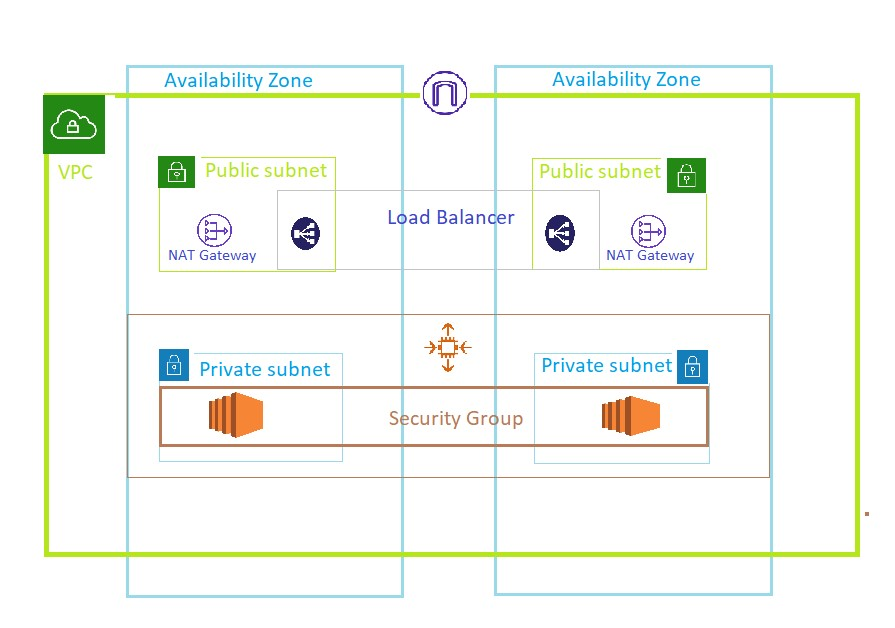

# Deploying Instance Securely in VPC

## About the Task
- To improve Resiliency, i deployed two servers in two Availability Zones by using an AutoScaling Group and an Application Load Balancer.
- For additional security, i deployed the servers in the private subnet.
- The servers receive requests from LoadBalancer.
- The servers can connect to the internet by using Internet Gateway.
- To improve Resiliency, i have deployed the NAT Gateway in both Availability Zones.

## Overview
- The VPC has public subnets and private subnets in two Availabilty Zones.
- Each public subnet contains a NAT Gateway and a LaodBalancer node.
- The servers run in the private subnets, are launched and terminated by using AutoScaling Group, and receive traffic from LoadBalancer.
- The servers can connect to the internet by using the NAT Gateway.